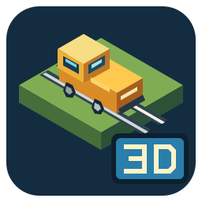
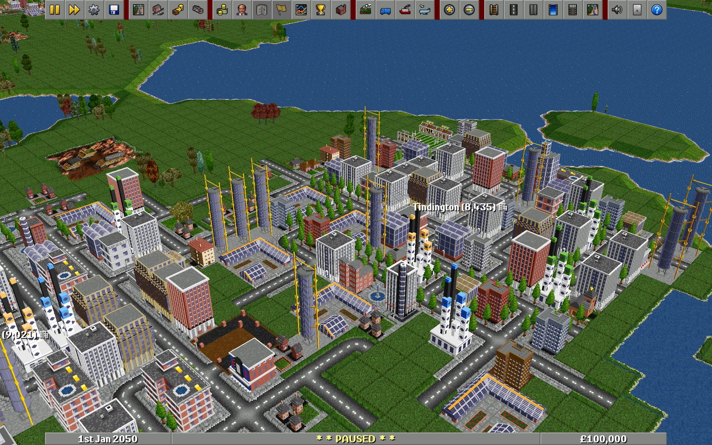
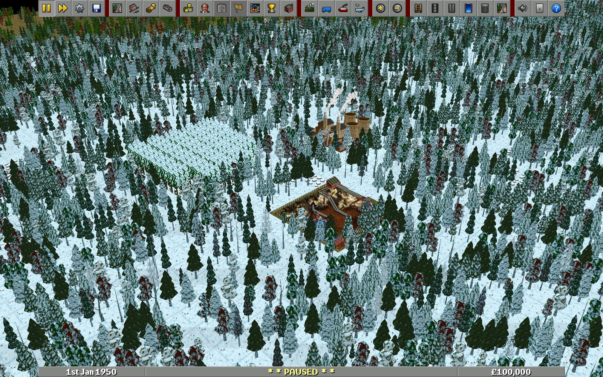
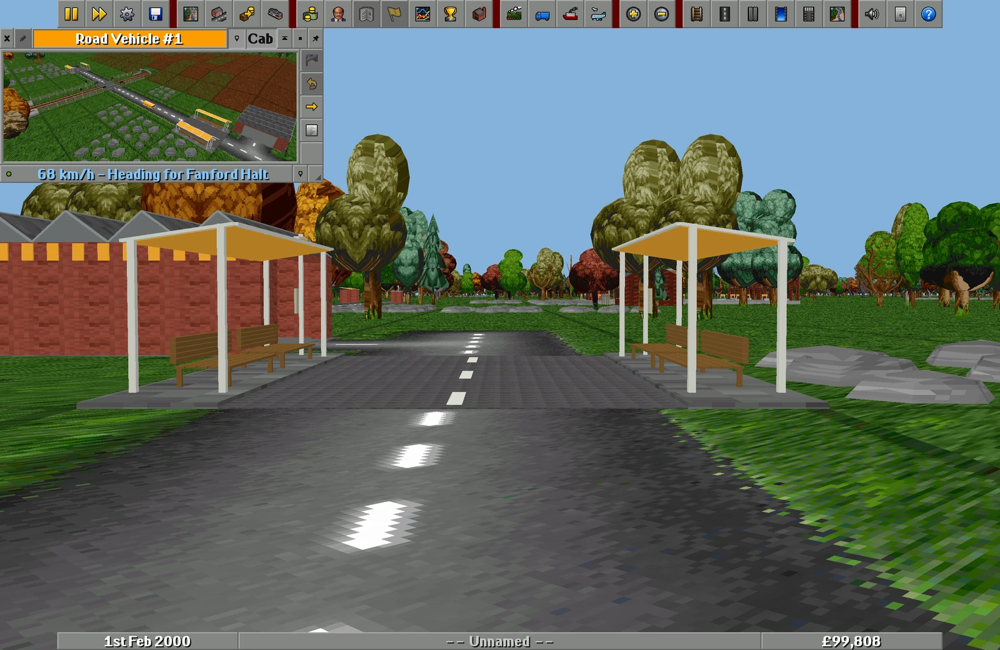

# OpenTT3D



**OpenTTD's transport simulation, presented as a rotatable 3D world.**

OpenTT3D is a renderer-focused source port of **OpenTTD 15.3**. It draws the
game world in 3D using **OpenGFX2 Classic 0.8.1** reference textures. Gameplay
commands, the save format and simulation remain the upstream engine's responsibility.

## Download & play

**[Download OpenTT3D for Windows, macOS, or Linux →](https://github.com/cstanislav/opentt3d/releases/tag/opentt3d-dev-20260927.29)**

Open a release's **Assets** and choose your platform:

| Platform | Download | Start playing |
| :--- | :--- | :--- |
| Windows | `windows-x64.exe` installer or `windows-x64.zip` portable archive | Install, or extract the ZIP, then run **OpenTT3D**. ARM64 and 32-bit builds are also provided. |
| macOS 15+ | `macos-arm64.dmg` (Apple silicon) or `macos-x86_64.dmg` (Intel) | Drag **OpenTT3D** into **Applications** and open it. |
| Linux x86-64 | `linux-x86_64.tar.xz` | Extract and run **`./opentt3d.sh`**. Debian 12 / Ubuntu 24.04 or newer recommended. |

The required graphics are included, and the game opens in 3D. No original game
files or development tools are needed. See **[installation and first-launch
instructions](opentt3d/PLAYING.md)**, including unsigned-app prompts and optional sound/music.

New releases automatically build desktop downloads; assets appear when the
[release workflow](https://github.com/cstanislav/opentt3d/actions/workflows/opentt3d-release.yml)
succeeds. **Desktop packages are available in the verified September 27 `.29` release**,
including installers, portable archives, matching source and checksums. Earlier
source-only previews have no executables. These are **development previews**:
artwork and performance remain in progress. See the current
[implementation status](opentt3d/STATUS.md), [verification results](opentt3d/VERIFICATION.md)
and [asset review notes](opentt3d/ASSET_REVIEW.md).

## Screenshots

[](docs/screenshots/coastal-city.webp)

*A coastal city in the rotatable 3D world.*

| Arctic landscape | Street-level Cab view |
| :---: | :---: |
| [](docs/screenshots/arctic-landscape.webp) | [](docs/screenshots/bus-cab.webp) |

## Camera controls

- **Hold the middle mouse button on terrain and drag:** orbit around the clicked
  point. Move sideways to rotate, up/down to tilt; release to keep the view.
- **Mouse wheel:** smooth, cursor-anchored dolly zoom down to street level; the lens stays fixed.
- **Cab button in a vehicle window:** enter or leave first-person following,
  with smoothly interpolated heading and motion. Middle-drag looks around; wheel
  zoom is disabled while following. Orbit and Cab use the same fixed 40° lens.
  There is no fixed draw-distance cutoff.
- **Ctrl+[ / Ctrl+]:** quarter-turn rotation; **Ctrl+\\:** reset orientation.
- Existing panning, construction tools, menus and vehicle controls remain available.

Infinite-water worlds render ocean beyond the playable map boundary to the horizon. The ocean
extension is presentation-only; construction and vehicle navigation keep the
original map limits.

## Build and run

Full development instructions are in [opentt3d/README.md](opentt3d/README.md).
Linux builds run in the project container:

```sh
docker build -t opentt3d-dev -f docker/Dockerfile .
docker run --rm --user "$(id -u):$(id -g)" -e HOME=/tmp \
  -v "$PWD:/workspace" -w /workspace opentt3d-dev \
  python3 tools/opentt3d/build.py --build-dir build-linux
```

With existing macOS build dependencies:

```sh
python3 tools/opentt3d/fetch_vulkan.py build-macos/vulkan
python3 tools/opentt3d/build.py --build-dir build-macos
build-macos/opentt3d \
  -X -x -c build-macos/opentt3d.cfg \
  -v cocoa-vulkan -b 40bpp-anim -I "OpenGFX2 Classic"
```

Both render backends keep world viewports on the GPU and compose the original UI
above them. macOS uses the pinned, build-local MoltenVK runtime; Linux uses the
`sdl-vulkan` driver. OpenGL remains available through `cocoa-opengl`, `sdl-opengl`
and `win32-opengl`, with bounded frame submission and on-demand picking. See [performance measurements](opentt3d/PERFORMANCE.md) for
fullscreen zoom results and remaining long-run frame-time work.

## Project and releases

- Repository and issue tracker: <https://github.com/cstanislav/opentt3d>
- Release destination: <https://github.com/cstanislav/opentt3d/releases>
- Gameplay manual: <https://wiki.openttd.org/>
- Preserved upstream documentation: [OpenTTD README](docs/UPSTREAM_README.md)

## Licence and credits

OpenTT3D builds on the work of the OpenTTD, OpenGFX and OpenGFX2 contributors.
Original credits and copyright notices are preserved. Code and derivative artwork
are distributed under GPL-2.0; see [COPYING.md](COPYING.md) and [CREDITS.md](CREDITS.md).
The authored branding source and its reproducible icon compiler are included in
`assets/branding/` and `tools/assets/compile_branding.py`.
