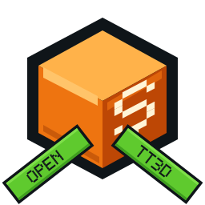
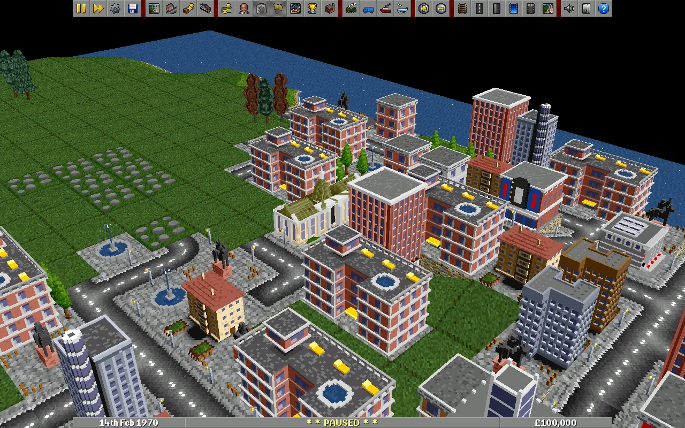
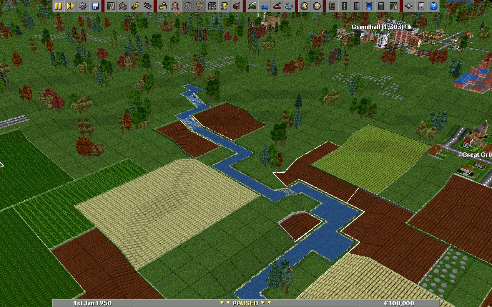
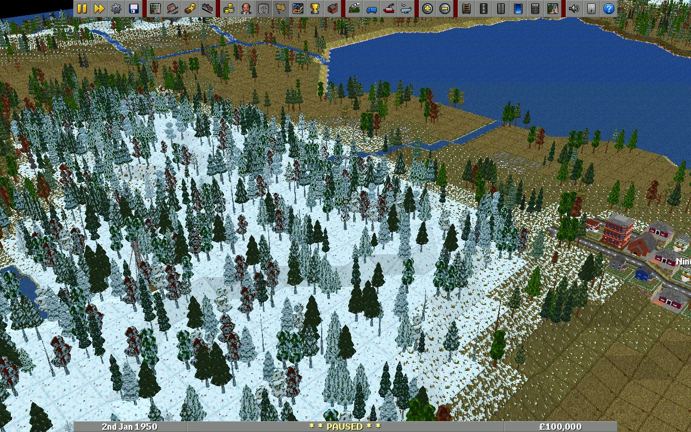
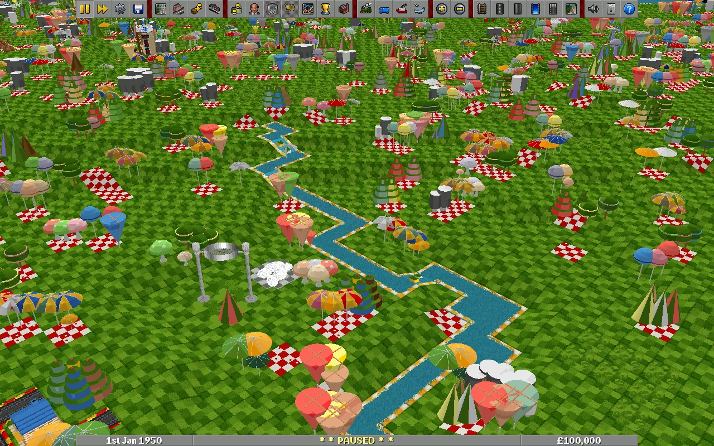
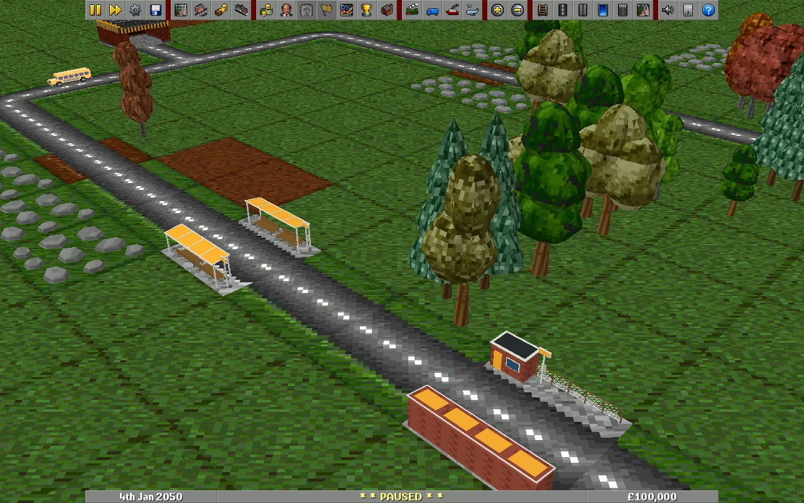
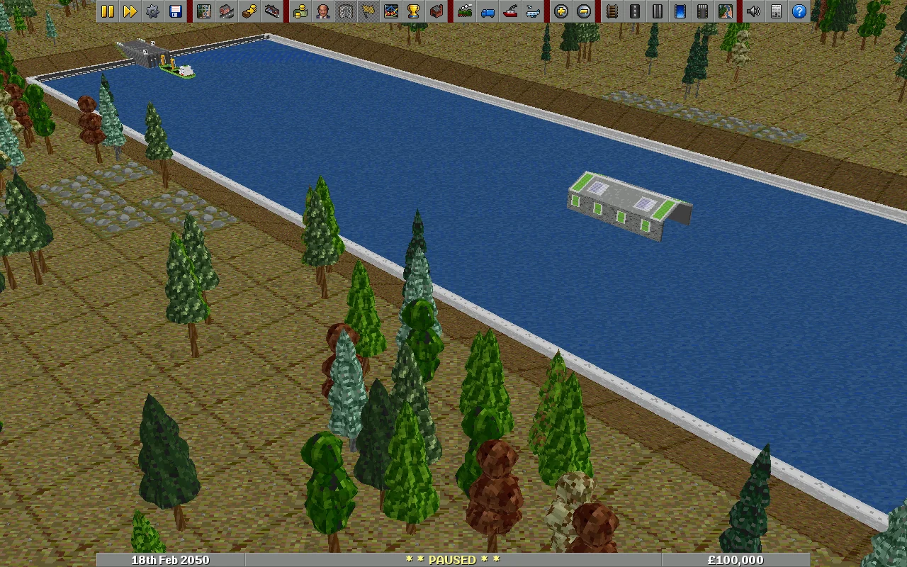
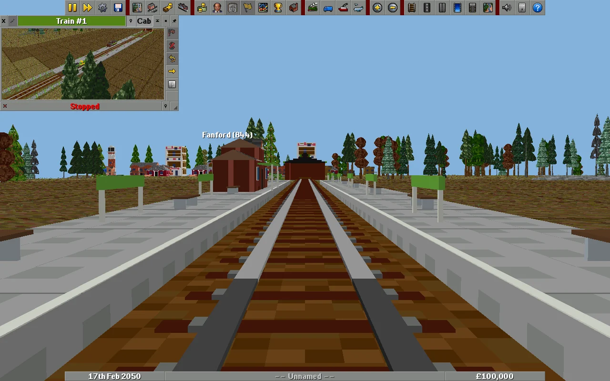
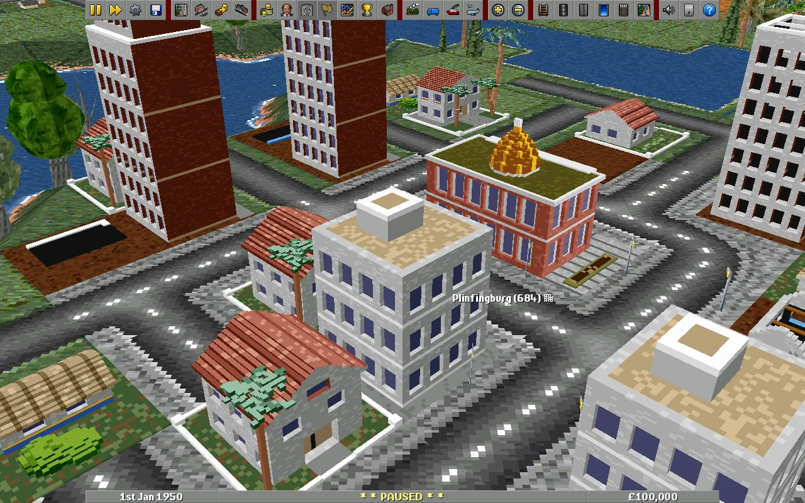

<p align="center">
  
</p>

<h1 align="center">OpenTT3D</h1>

<p align="center"><strong>OpenTTD's transport simulation, rebuilt as a rotatable 3D world.</strong></p>

<p align="center">
  <a href="https://github.com/cstanislav/opentt3d/releases">Releases</a> ·
  <a href="opentt3d/PLAYING.md">Play</a> ·
  <a href="opentt3d/STATUS.md">Status</a> ·
  <a href="opentt3d/PERFORMANCE.md">Performance</a>
</p>

OpenTT3D is a renderer-focused source port of **OpenTTD 15.3**. Vehicles, stations,
industries, houses, trees, terrain details and water edges are drawn as real
geometry against **OpenGFX2 Classic 0.8.1** materials. The original simulation,
commands, save format, NewGRF behaviour and user interface stay on the upstream
engine's path.

> **Development status:** playable development previews. The 3D catalogue and
> performance work are still in progress; this README does not claim that every
> model has reached its final detail level. The immutable
> [`.42` release](https://github.com/cstanislav/opentt3d/releases/tag/opentt3d-dev-20261003.42)
> is the recommended desktop checkpoint. [`.44`](https://github.com/cstanislav/opentt3d/releases/tag/opentt3d-dev-20261004.44)
> is a newer recovery draft awaiting independent publication checks.

## Download and play

Open the [recommended release](https://github.com/cstanislav/opentt3d/releases/tag/opentt3d-dev-20261003.42),
expand **Assets**, and choose a package:

| Platform | Package | Start |
| :--- | :--- | :--- |
| Windows | `windows-x64.exe` installer or `windows-x64.zip` | Install, or extract and run **OpenTT3D**. ARM64 and 32-bit builds are included. |
| macOS 15+ | `macos-arm64.dmg` or `macos-x86_64.dmg` | Drag **OpenTT3D** to **Applications** and open it. |
| Linux x86-64 | `linux-x86_64.tar.xz` | Extract and run **`./opentt3d.sh`**. Debian 12 / Ubuntu 24.04 or newer recommended. |

Graphics are bundled. No original game files or development tools are required.
See [first-launch instructions](opentt3d/PLAYING.md) for unsigned-app prompts and
optional sound/music.

## A 3D transport world

| | |
| :---: | :---: |
| [](docs/screenshots/hero-city.webp) | [](docs/screenshots/temperate-river.webp) |
| *A working city with real building, road and roof relief.* | *River banks, fields and hills in the fixed 40° world camera.* |
| [](docs/screenshots/arctic-landscape.webp) | [](docs/screenshots/toyland-parade.webp) |
| *Arctic snow, conifers and a frozen shoreline.* | *Toyland's full colour range, with 3D trees and buildings.* |
| [](docs/screenshots/bus-stop-ground.webp) | [](docs/screenshots/canal-quay.webp) |
| *Bus-stop lanes now sample the adjoining road surface.* | *Canal edges are stepped stone quays instead of flat borders.* |
| [](docs/screenshots/train-cab.webp) | [](docs/screenshots/bank-cupola.webp) |
| *First-person following with the same fixed lens.* | *Joined bank bodies keep the cupola centred across the tile seam.* |

## Camera controls

- **Middle-drag on the world:** orbit around the clicked point. Move sideways to
  rotate, up/down to tilt; release to keep the view.
- **Mouse wheel:** smooth, cursor-anchored dolly zoom down to street level. The
  lens stays fixed at 40°.
- **Cab button in a vehicle window:** enter or leave first-person following with
  smoothly interpolated heading and motion. Middle-drag looks around; wheel zoom
  is disabled while following. There is no persistent Cab zoom.
- **Ctrl+[ / Ctrl+]:** quarter-turn rotation. **Ctrl+\\:** reset the orientation.
- Existing panning, construction tools, menus, orders and vehicle controls remain
  available.

Infinite-water worlds render ocean beyond the playable map boundary to the
horizon. This is presentation-only; construction and navigation keep the original
map limits.

## What is modelled

- Terrain, foundations, slopes and clear-land detail.
- Houses, industries, objects, headquarters, banks, docks, depots, stations,
  bus/truck stops, tunnels, bridges, locks and canal quays.
- Vehicles, aircraft, ships, trains, road vehicles, cargo variants and animation
  phases.
- Trees, crops, fences, ground cover, effects and crash/effect sources where a
  complete original-source volume exists.
- Independent ground, body and water ownership; original dimensions,
  registration, openings, clearances and picking stay separate from the model
  geometry.

Some families and state combinations still use the original sprite layer, an
explicit fallback, or a diagnostic study that is not active at runtime. The
[asset review ledger](opentt3d/MODEL_RATINGS.csv) and
[status notes](opentt3d/STATUS.md) record what is accepted, what is provisional,
and which comparisons still fail.

## Nightly CI and upstream

The nightly workflow builds macOS x86-64 and both MinGW targets. Recent runs
failed during checkout because retained review evidence exceeds Windows'
`MAX_PATH`; the workflows now enable Git long paths before checkout and use a
filesystem-capable macOS deployment target. See
[the current CI runs](https://github.com/cstanislav/opentt3d/actions).

The upstream stable release is **OpenTTD 15.3**. OpenTTD **16.0-beta4** is the
newest upstream prerelease; it is not merged into this port yet. The scheduled
upstream check reports both the latest stable and the newest prerelease.

## Build and run

Full development instructions are in [opentt3d/README.md](opentt3d/README.md).
Linux builds run in the project container:

```sh
docker build -t opentt3d-dev -f docker/Dockerfile .
docker run --rm --user "$(id -u):$(id -g)" -e HOME=/tmp \
  -v "$PWD:/workspace" -w /workspace opentt3d-dev \
  python3 tools/opentt3d/build.py --build-dir build-linux
```

With the macOS build dependencies installed:

```sh
python3 tools/opentt3d/fetch_vulkan.py build-macos/vulkan
python3 tools/opentt3d/build.py --build-dir build-macos
build-macos/opentt3d \
  -X -x -c build-macos/opentt3d.cfg \
  -v cocoa-vulkan -b 40bpp-anim -I "OpenGFX2 Classic"
```

Both backends keep the world viewport on the GPU and compose the original UI
above it. macOS uses the pinned build-local MoltenVK runtime; Linux uses
`SDL Vulkan`. OpenGL is available through `cocoa-opengl`, `sdl-opengl` and
`win32-opengl`. See [performance measurements](opentt3d/PERFORMANCE.md) for the
remaining long-run frame-time work.

## Project

- Repository and issue tracker: <https://github.com/cstanislav/opentt3d>
- Release destination: <https://github.com/cstanislav/opentt3d/releases>
- Gameplay manual: <https://wiki.openttd.org/>
- Preserved upstream documentation: [OpenTTD README](docs/UPSTREAM_README.md)
- Rendering boundary and test policy: [opentt3d/README.md](opentt3d/README.md)

## Licence and credits

OpenTT3D builds on the work of the OpenTTD, OpenGFX and OpenGFX2 contributors.
Original credits and copyright notices are preserved. Code and derivative
artwork are distributed under GPL-2.0; see [COPYING.md](COPYING.md) and
[CREDITS.md](CREDITS.md). The branding source and reproducible icon compiler are
in `assets/branding/` and `tools/assets/`.
